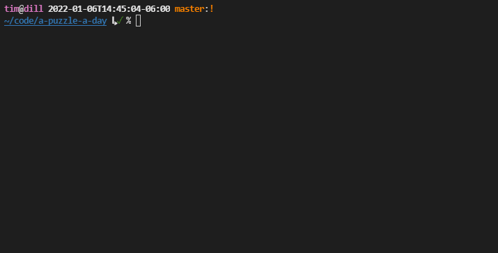
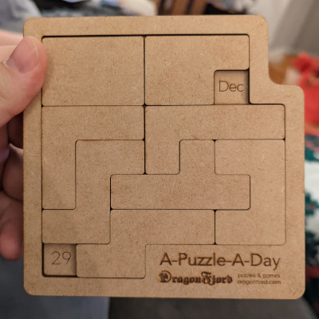

# a-puzzle-a-day

Find all solutions for the "A-Puzzle-A-Day" puzzle and save them to JSON files. Also, pretty-print
the solutions so you can read them.

## Usage

### Printing Solutions

```sh
$ poetry run python print.py a-puzzle-a-day-solutions\Dec-029.json
```



You need a terminal that supports truecolor (arbitrary hex triplets) and a font that can
represent some special Unicode characters (see source).

### Solving

```sh
$ poetry run python solve.py
```

```text
  Solving... ━━━━━━━━━━━━━━━━━━━━━━━━━━━━━━━━━━━━━━━━ 100% 5789/5789 1:59:23 0:00:00
```

On my machine, finding all solutions took about 2 hours. This code uses Python's
[multiprocessing](https://docs.python.org/3/library/multiprocessing.html) library to utilize all the
cores on your machine.

There is a progress bar to soothe your mind. The count in the progress bar is an arbitrary unit
of work that is being doled out to each processor.

**I have included all solutions [here in this repo](a-puzzle-a-day-solutions/), so you don't have
to do this step!** I think it is the complete set.

If you recreate the solution files, the contents of the files will likely be different because of
the ordering of the solutions is not deterministic (depends on your machine CPU, scheduling, load,
etc.).

## Installation

1. Get [Python](https://www.python.org/downloads/) and [Poetry](https://python-poetry.org/).

2. Clone this repo and install its dependencies

   ```sh
   git clone https://github.com/t-mart/a-puzzle-a-day.git
   cd a-puzzle-a-day
   poetry install
   ```

## What is this puzzle?




You try to get all of the eight pieces to lay flat within the board, keeping exposed only 2 squares
for today's date. You can buy one [here](https://www.dragonfjord.com/product/a-puzzle-a-day/).

## Interesting stats

- There are 59,787 *unique* solutions.

  (Here, *unique* means that we do not count solutions where a piece is rotated or flipped to
  produce a symmetrical placement.)
- Of those, 24,405 of the solutions are for *valid* dates (including Feburary 29th, the leap day).
  That represents roughly 40% of all solutions.

  (*Valid* means that the the solution leaves exposed the squares for components that could
  represent a real date. For example, "Apr" and "31" is not valid because April only has 30 days.
  Similarly, solutions with two number components or two month component are invalid because they
  are nonsensical.)
- The most solvable valid date is January 25th with 216 unique solutions. The least solvable
  valid date is October 6th, with 7 unique solutions.